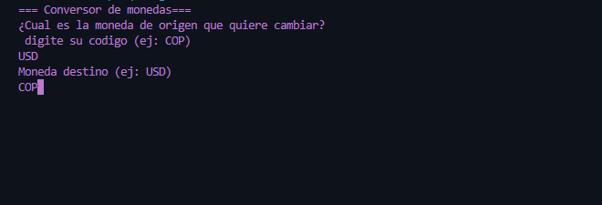
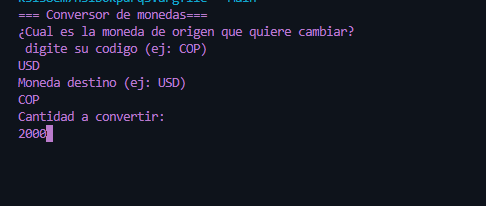
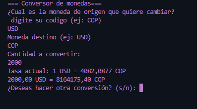
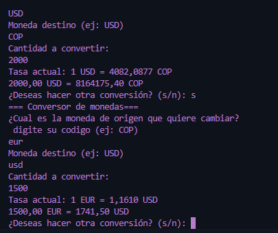

# Converor-Monedas

**Conversor-Monedas** es una aplicación de consola escrita en Java que permite convertir valores entre distintas monedas utilizando una API externa. Es ideal como proyecto educativo para practicar el uso de APIs REST, manejo de JSON con Gson y programación orientada a objetos en Java.

## 🚀 Características

- Conversión de moneda en tiempo real.
- Entrada por consola para definir moneda origen, destino y monto.
- Uso de `HttpClient` para consultar una API pública.
- Parsing de JSON usando `Gson`.

## 🛠️ Tecnologías utilizadas

- Java 17+
- Gson 2.13.1
- API REST pública

## ⚙️ Cómo ejecutar

1. Clona el repositorio o descarga el `.zip`.
2. Asegúrate de tener Java 17 o superior instalado.
3. Compila los archivos:

```bash`````
javac -cp "lib/gson-2.13.1.jar" -d bin src/**/*.java 


## 📷 Capturas de pantalla

### 🧾 1. Inicio de la aplicación
El usuario inicia el programa y se le solicita ingresar la moneda de origen (por ejemplo, USD).


### 🔁 2. Ingreso de moneda destino y monto
Después de ingresar la moneda origen, el programa solicita la moneda destino y el monto que se desea convertir.


### 💱 3. Resultado de la conversión
El sistema muestra el resultado de la conversión: la tasa de cambio y el valor convertido entre las dos monedas seleccionadas.


### 🔄 4. Conversión adicional
El usuario realiza una segunda conversión. El programa permite múltiples conversiones en una misma sesión sin reiniciar.

